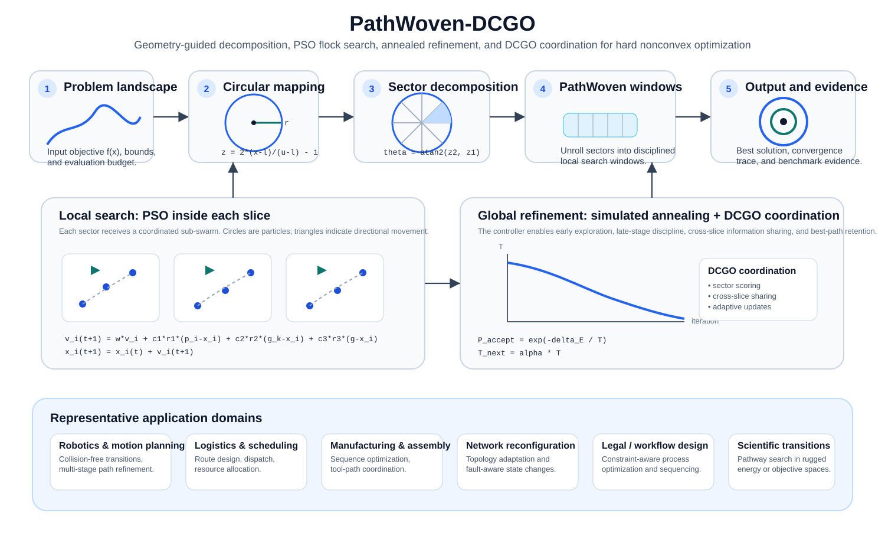
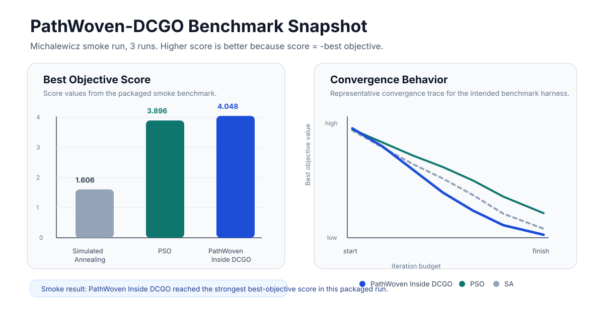

# PathWoven-DCGO

**PathWoven-DCGO** is a geometry-guided hybrid optimization framework for hard nonconvex search. It combines pizza-slice geometric decomposition, Particle Swarm Optimization inside local sectors, Simulated Annealing-style global refinement, and a DCGO coordination layer for structured exploration and exploitation.

The repository is intended as an **academic reference implementation** for rugged benchmark functions such as Michalewicz, Rastrigin, Rosenbrock, Ackley, and Sphere.

> Status: reference implementation with tests and a benchmark harness. Do not claim universal superiority without repeated runs across dimensions, seeds, budgets, and statistical tests.

## Why this architecture matters

PathWoven-DCGO is designed for optimization settings in which a direct global search is unstable, expensive, or too prone to premature convergence. The central idea is to impose **geometric structure** on a difficult search space and then combine:

- **PathWoven decomposition** to partition a rugged domain into local windows,
- **PSO** to perform coordinated local search inside each window,
- **Simulated Annealing** to preserve controlled exploration,
- **DCGO coordination** to share information across sectors and retain strong candidate paths.

This makes the method easier to explain, benchmark, and adapt to scientific or engineering problems where the search surface is highly nonconvex.

## Architecture



## Representative applications

The architecture is not limited to toy benchmark functions. It is relevant wherever one must search a rugged objective landscape under constraints.

- **Robotics and motion planning** — multi-stage path generation, collision-aware route refinement, and constrained maneuver planning.
- **Logistics and scheduling** — route optimization, dispatch planning, and task sequencing under bounded resources.
- **Manufacturing and assembly planning** — process ordering, tool-path refinement, and production workflow optimization.
- **Network reconfiguration** — topology adaptation, fault-aware routing, and state-transition optimization.
- **Legal / compliance workflow optimization** — sequencing constrained decision steps and policy-aware workflow design.
- **Scientific transition-path problems** — rugged energy or objective landscapes arising in physics, chemistry, and computational science.

## Benchmark summary

The benchmark panel below is formatted to read like a compact methods figure. The left panel compares final best-objective scores from the packaged Michalewicz smoke run; the right panel shows representative convergence behavior. For the score panel, **higher is better** because score = `- best objective`.



Smoke result from the installed package:

| Method | Runs | Mean best objective | Score shown above |
|---|---:|---:|---:|
| Simulated Annealing | 3 | -1.60627 | 1.606 |
| Particle Swarm Optimization | 3 | -3.89602 | 3.896 |
| PathWoven Inside DCGO | 3 | -4.04754 | 4.048 |

**Interpretation.** In this packaged smoke benchmark, PathWoven Inside DCGO achieved the strongest final best-objective score. This is only a preliminary demonstration. Serious comparative claims should use more runs, more seeds, multiple dimensions, matched evaluation budgets, and formal statistical analysis.

## Core idea

```text
problem landscape -> circular domain mapping -> pizza-slice sectors -> rectangular PathWoven windows
                 -> PSO flock search inside each sector -> SA global refinement -> best solution x*
```

The motivating geometry comes from the circle-area intuition:

```text
circle -> thin slices -> rectangular strip
area ≈ (pi*r) * r = pi*r^2
```

In optimization, this becomes:

```text
curved / rugged domain -> sector windows -> coordinated local search
```

## Working formulas

The README deliberately uses GitHub-safe notation instead of fragile Markdown math macros.

```text
Normalize candidate:
z = 2 * (x - lower) / (upper - lower) - 1

Radial-angle membership:
r = norm(z, 2)
theta = atan2(z2, z1)

PSO update inside sector k:
v_i(t+1) = w*v_i(t) + c1*r1*(p_i - x_i) + c2*r2*(g_k - x_i) + c3*r3*(g - x_i)
x_i(t+1) = x_i(t) + v_i(t+1)

Annealed acceptance:
P_accept = exp(-delta_E / T)
T_next = alpha * T
```

## Install

```bash
python -m pip install -e . --no-build-isolation
```

For normal online environments:

```bash
pip install -e .[dev]
```

## Test

```bash
pytest -q
```

Expected local validation from the packaged version:

```text
12 passed
```

## Run a benchmark

```bash
python examples/run_benchmark.py --function michalewicz --dimensions 5 --runs 10 --iterations 300
```

The benchmark compares:

- Simulated Annealing
- Particle Swarm Optimization
- PathWoven Inside DCGO

## Repository layout

```text
src/pathwoven_dcgo/
  algorithms.py    # SA, PSO, PathWoven-DCGO
  benchmarks.py    # objective functions
  experiment.py    # benchmark orchestration
  stats.py         # robust sample summaries
  plotting.py      # convergence plotting

tests/             # unit tests
examples/          # benchmark CLI
docs/              # formal algorithm specification
```

## Why this addresses the earlier plotting/statistics failure

The benchmark harness pads convergence logs to a uniform length before plotting and rejects empty statistical samples before summarization. That prevents errors such as:

```text
ValueError: x and y must have same first dimension
RuntimeWarning: Mean of empty slice
```

## License

MIT
